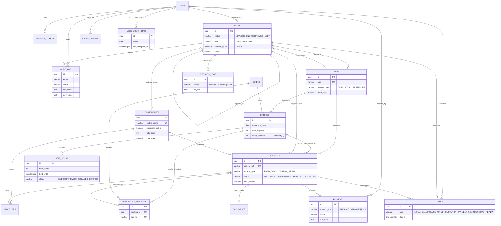

# Entity-Relationship Diagram — SecureTravels CRM (Phase 1, V1–V6)

Mermaid `erDiagram` mirroring `docs/DATABASE.md`. Notation: `}o` = zero-or-more,
`}|` = exactly-one, `|o` = zero-or-one.

Key invariants (see `docs/DATABASE.md`):
- **I1/I2** — booking ↔ trip booking_type consistency, FIXED_BATCH ⇔ batch,
  enforced by `trg_booking_consistency`.
- **I3** — `batches.seats_booked` = CONFIRMED + active HELD, PESSIMISTIC_WRITE.
- **I6** — exactly one `operations_handoffs` per booking (created on CONFIRMED).