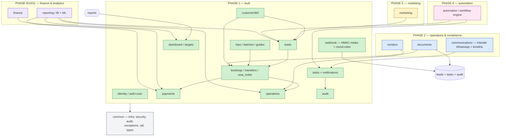

# Module Map — SecureTravels CRM

Mermaid `flowchart` of the module layout across phases. Single jar, one
inbound route per module (see `ARCHITECTURE.md`).

Same map, as a phase × module table (the spec authorities are
`PRODUCT_REQUIREMENTS.md` and `ROADMAP.md`):

| Phase | Modules |
|---|---|
| 1 (built) | identity, leads, trips, bookings, payments, operations, customers, tasks, audit, dashboard/+targets, webhook |
| 2 | documents, vendors (+ Redis, RabbitMQ, automation rules full form) |
| 3 | mobile-ops, reporting suite, OpenSearch, Prometheus/Grafana |
| 4 (scale-gated) | Keycloak IAM, ABAC, Vault, multi-branch |
| 4 | communications (Interakt WhatsApp, unified timeline) |
| 5 | marketing (Meta/Google) |
| 6 | automation workflow engine (first Kafka *evaluation*) |
| 7 | sales depth (accounts/opportunities/forecast/commission) |
| 8 (reassess) | service/support |
| 9 | finance (invoicing/payouts/GST/P&L) |
| 10 | advanced BI dashboards |
| 11 | AI (ML scoring/forecast/chatbot) |
| 12 | hardening & scale |